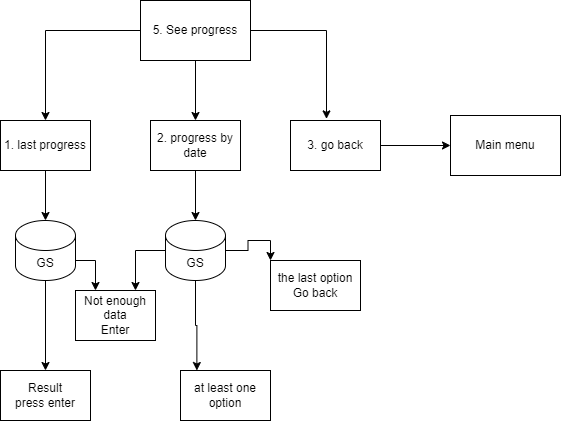
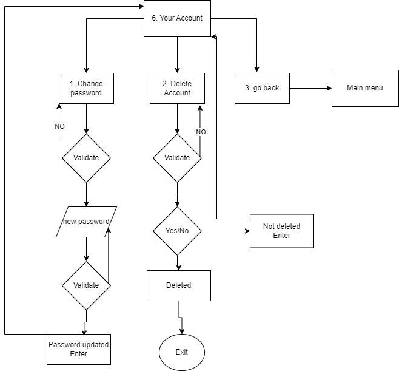

# Calories Tracker
Calories Tracker is a terminal-based application designed to put the user in control of their diet and overall well-being. With a comprehensive set of features, it empowers users to make informed dietary choices, set personalized calorie limits, and track their progress over time. From exploring an extensive product database to recording daily intake and weight, this application simplifies every aspect of calorie management.

## Planning & Development
- __Target audience__
    - Health-Conscious Individuals: People who are focused on maintaining a healthy lifestyle, managing their weight, and making informed dietary choices.
    - Weight Watchers: Those looking to lose, gain, or maintain their weight by tracking their calorie intake and staying within specific calorie limits.
    - Athletes: Sports enthusiasts, athletes, and trainers who need precise control over their calorie intake to support their training and performance goals.
    - Health Professionals: Dietitians, and healthcare professionals who use the app as a tool to help their clients manage their diets.
    - Anyone Seeking Better Health: People who simply want to improve their overall health and well-being by tracking their food intake.

- __App Objectives__
    - Empower Healthy Eating: Encourage users to make healthier dietary choices by providing them with accurate calorie information for various foods.
    - Weight Management: Assist users in achieving their weight management goals, whether it's losing, gaining, or maintaining weight, by helping them set and track personalized calorie limits.
    - User Engagement: Keep users engaged with the app by providing features such as progress tracking, setting daily calorie limits, and tracking daily intake and weight.
    - Simplicity and User-Friendliness: Ensure that the app is easy to use and navigate, even for individuals who may not be tech-savvy.
    - Data Privacy and Security: Safeguard user password.

- __User story__
    - Customizable Daily Calorie Limit: I can set my daily calorie limit based on my weight management goals, whether it's losing, gaining, or maintaining weight.
    - Daily Logging: The app enables me to log my daily calories intake.
    - Food Database: The app offers a comprehensive food database that includes a wide variety of foods, with accurate calorie information. It allows me to search for and select foods easily.
    - Progress Tracking: The app displays my progress, including the number of calories consumed and remaining for the day.
    - Weight Tracking: I can input my daily weight, and the app records and displays this data showing trends over time.
    - Data Privacy: The app ensures the privacy and security of my password.
    - User Account Management: As a user, I want the ability to change my password and delete my account in the app.
    - Product Table Management: The app allows me to edit product names and their calorie counts, as well as add new products or delete existing ones within the product table.

- __Flow chart__
  - This flowchart illustrates the functionality and user interactions of the Calories Tracker App. The flowchart was created during the planning stage, but the actual project is a bit more complex.

   
  

Auth

    

  

  

Main menu

    

  

  

Product table

    

  

  

Calculate menu

    

  

  

Get personal data menu

    

  

  

Set personal data menu

    

  

  

See your progress menu

    

  

  

Your Account menu

    

  

- __Colors__
- To improve user experience, colors were implemented. Two colors were deemed sufficient: green for success and red for errors. In the terminal, text that indicates success is displayed in green, while errors are displayed in red.

- __Technologies__
  - Python

## Features

### User Registration and Login:
- To use the application, users are required to either register a new account or log in with their existing credentials.
- During registration, users provide a unique username and a password of their choice.
- Registered users can securely log in using their username and password.
- Passwords are securely hashed before being stored in the application's database. Hashing ensures that user passwords are protected and not stored in plain text, enhancing security.
- This feature ensures that the application can track and store user progress accurately over time while maintaining the security of user account information with a minimal registration process.

### Product table menu
- Add Product:
 - This option allows the user to input details for a new product, such as product name and its calories. Once the user provides the information, the application validates and then adds the product to the Google Sheet.

- Read Product:
 - Users can choose this option to view product information. They can search for a product by entering its name.
The application retrieves and displays the product details from the Google Sheet.

- Update Product:
 - Users can select this option to update the information of an existing product.
They should be prompted to enter the product's unique identifier that is the name of a product and then update the desired fields (name or calories). The changes are reflected in the Google Sheet.

- Delete Product:
 - This option allows the user to remove a product from the product table. Users should provide the name of the product they want to delete. The application removes the corresponding product entry from the Google Sheet.

- Go back:
 - Selecting this option exits the product table menu and goes back to the main menu.

### Calculate Calories:

- When the user selects this option, the application prompts them to enter the name of a product they want to calculate calories for.
- The application checks if the product exists in the Google Sheet. If it does not exist, it offers to add the product to the sheet.
- If the product exists, the application retrieves and displays the calories per 100g for that product.
- The user is prompted to enter the quantity in grams of the product they consumed.
- The application calculates the total calories based on the quantity entered and the calories per 100g.
- It then offers the user the option to add these calories to their daily intake record in the Google Sheet.
- If the user selects "Yes," the application adds the calories consumed to the daily intake record and returns to the main menu.
- If the user selects "No," the application keeps calculating and allows the user to search for another product.
- The application also keeps track of the calories from previous calculations, so the user can continue adding multiple products to their daily intake record without losing previous data.

### Get personal data

#### Get Calories Limit
  - If the user selects "Get Calories Limit," the application checks if a calories limit is set for the user.
  - If a calories limit is set, the application displays the current calories limit.
  - It also shows how many calories have been consumed today.
  - Additionally, it provides information on whether the user has exceeded the calorie limit and by how many calories, or how many calories are needed to reach the set limit.

####  Get Calories Consumed Today:

  - If the user selects "Get Calories Consumed Today," the application displays the total calories consumed for the current day.
  - Additionally, it provides information on whether the user has exceeded the calorie limit and by how many calories, or how many calories are needed to reach the set limit.

### Set Personal Data

#### Set Calories Limit:

  - If the user selects "Set Calories Limit," the application prompts the user to enter their desired daily calorie limit. The application then saves this limit in the user's profile for future reference.

#### Add Weight:

  - If the user selects "Add Weight," the application allows the user to input their weight for the day. The application can store this data for historical tracking, allowing users to monitor their weight changes over time.

#### Log Calories Consumed Today:

  - If the user selects "Log Calories Consumed Today," the application prompts the user to enter the number of calories they've consumed for the current day.
  - The application retrieves the previously logged calories consumed today (if any) and adds the newly entered calories to the existing total.
  - It then updates the daily calorie consumption record for the user, reflecting the combined total of calories consumed today.

### See Progress

#### Last Progress:
  - If the user selects "See Last Progress," the application checks if there is enough data for calculating progress.
  - If there is not enough consecutive data (e.g., less than 7 days), the application displays a message indicating that there isn't enough data to calculate progress.
  - If there is enough consecutive data, the application calculates and displays the average calorie intake for those consecutive days and the amount of weight lost during that period.

#### Progress for Consecutive Days
  - If the user selects "See Progress for Consecutive Days," the application checks the available consecutive tracking data and generates options based on the number of days tracked.
  - The application displays a list of options, each representing a consecutive tracking period, starting from the earliest recorded date and ending with the most recent recorded date.
  - The user can select a specific tracking period (e.g., "See Progress from Date A to Date B") to view progress for that period.
  - If the user has tracked data for 20 days and forgot to track on the 21st day but continued tracking on subsequent days, the application will generate options for progress analysis for each consecutive period.
  - Each option displays the average calorie intake and weight loss or gain for the selected period.

### User Account:

#### Change Password
  - If the user selects "Change Password," the application prompts the user to enter their new password.
  - The application informs the user that their password has been updated

#### Delete Account
  - If the user selects "Delete Account," the application presents a confirmation prompt to ensure the user's intention to delete their account.
  - The user must confirm their choice to delete the account.
  - If confirmed, the application deletes the user's account, including all associated data.
  - The application then displays a goodbye message.
  - After displaying the goodbye message, the application exits, bringing the user back to the terminal prompt.

### Colors

#### Color-Coding for Success:
  - Whenever an action is successful, such as adding a product, updating personal data, or changing a password, the application displays a message in green to indicate success.

#### Color-Coding for Errors:
  - If an error occurs, such as an incorrect input or product not found, the application displays a message in red to indicate an error.