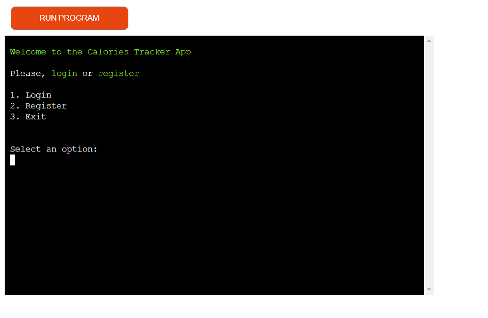
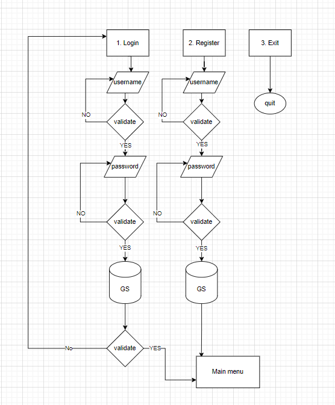
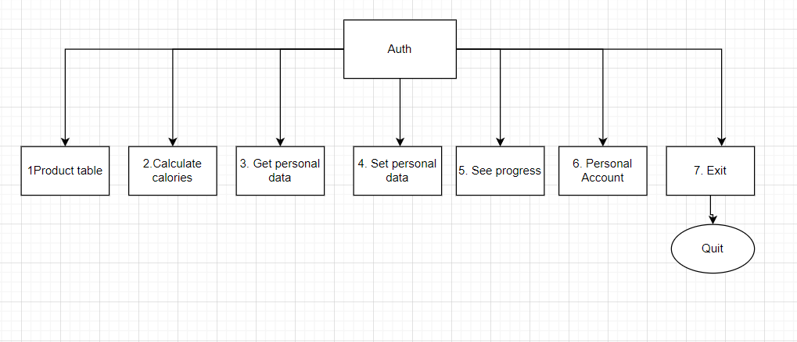
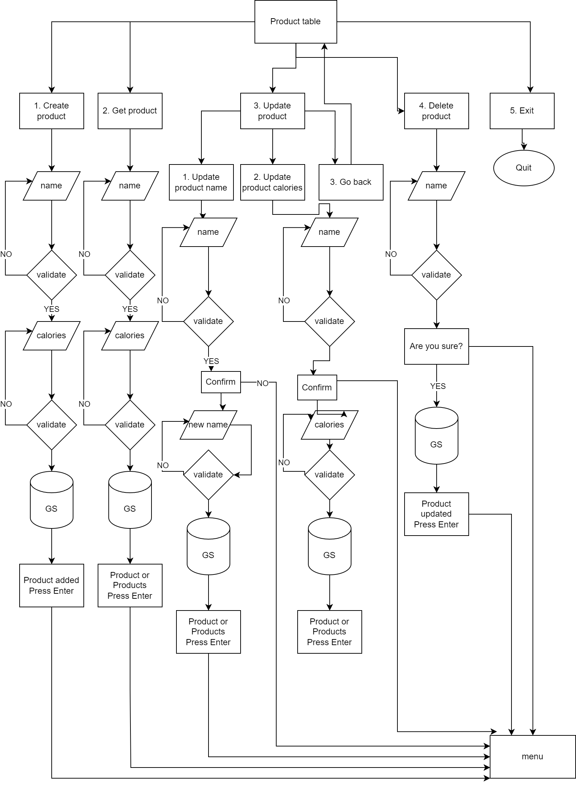
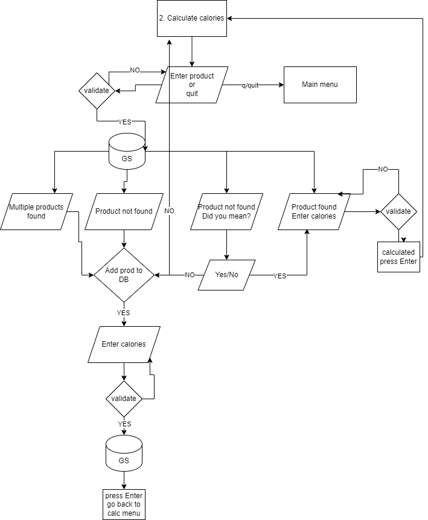
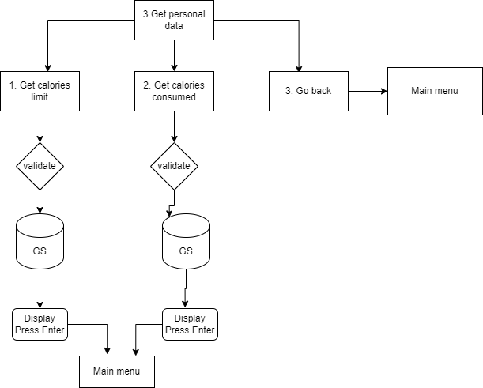
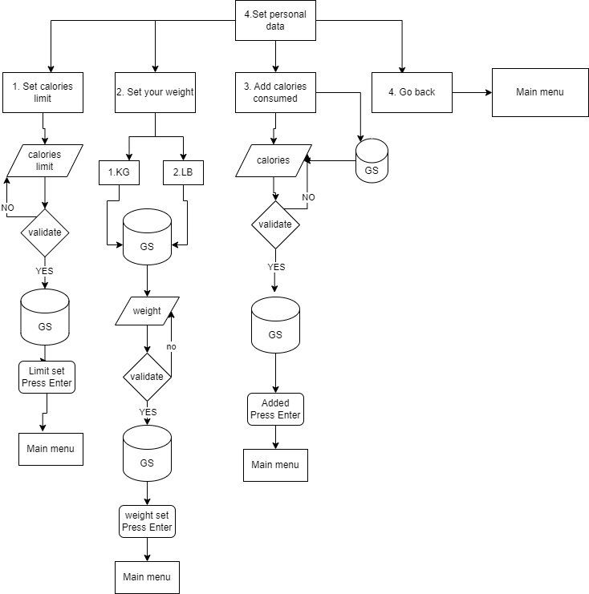

# Calories Tracker
Calorie Tracker is a terminal-based application designed to put the user in control of their diet and overall well-being. With a comprehensive set of features, it empowers users to make informed dietary choices, set personalized calorie limits, and track their progress over time. From exploring an extensive product database to recording daily intake and weight, this application simplifies every aspect of calorie management.

## Planning & Development
- __Target audience__
    - Health-Conscious Individuals: People who are focused on maintaining a healthy lifestyle, managing their weight, and making informed dietary choices.
    - Weight Watchers: Those looking to lose, gain, or maintain their weight by tracking their calorie intake and staying within specific calorie limits.
    - Athletes: Sports enthusiasts, athletes, and trainers who need precise control over their calorie intake to support their training and performance goals.
    - Health Professionals: Dietitians, and healthcare professionals who use the app as a tool to help their clients manage their diets.
    - Anyone Seeking Better Health: People who simply want to improve their overall health and well-being by tracking their food intake.

- __App Objectives__
    - Empower Healthy Eating: Encourage users to make healthier dietary choices by providing them with accurate calorie information for various foods.
    - Weight Management: Assist users in achieving their weight management goals, whether it's losing, gaining, or maintaining weight, by helping them set and track personalized calorie limits.
    - User Engagement: Keep users engaged with the app by providing features such as progress tracking, setting daily calorie limits, and tracking daily intake and weight.
    - Simplicity and User-Friendliness: Ensure that the app is easy to use and navigate, even for individuals who may not be tech-savvy.
    - Data Privacy and Security: Safeguard user password.

- __User story__
    - Customizable Daily Calorie Limit: I can set my daily calorie limit based on my weight management goals, whether it's losing, gaining, or maintaining weight.
    - Daily Logging: The app enables me to log my daily calories intake.
    - Food Database: The app offers a comprehensive food database that includes a wide variety of foods, with accurate calorie information. It allows me to search for and select foods easily.
    - Progress Tracking: The app displays my progress, including the number of calories consumed and remaining for the day.
    - Weight Tracking: I can input my daily weight, and the app records and displays this data showing trends over time.
    - Data Privacy: The app ensures the privacy and security of my password.
    - User Account Management: As a user, I want the ability to change my password and delete my account in the app.
    - Product Table Management: The app allows me to edit product names and their calorie counts, as well as add new products or delete existing ones within the product table.

- __Flow chart__
  - This flowchart illustrates the functionality and user interactions of the Calories Tracker App. The flowchart was created during the planning stage, but the actual project is a bit more complex.

   
  

Auth

    

  

  

Main menu

    

  

  

Product table

    

  

  

Calculate menu

    

  

  

Get personal data menu

    

  

  

Set personal data menu

    

  

- __Colors__
- To improve user experience, colors were implemented. Two colors were deemed sufficient: green for success and red for errors. In the terminal, text that indicates success is displayed in green, while errors are displayed in red.

- __Technologies__
  - Python